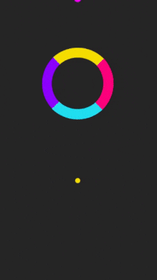

# Color_Switch_Replica

A "Color Switch" game replica, 2D fun endless mobile game.

## Screenshot:

## Game logic:
Tap the screen to make the ball jump, touch similar colors only!

## Tools used:
* Visual studio Code (Text Editor)
* C# (logic)
* Unity (game engine)
* Paint.Net (Image editting)

## Contribution:
Feel free to `fork` this project and add whatever you like. If you have any suggestions or any comments please feel free to contact me or to open an issue, use free license art assets please.

## Team:
[Jetlighters](https://github.com/JetLightStudio) having fun.
